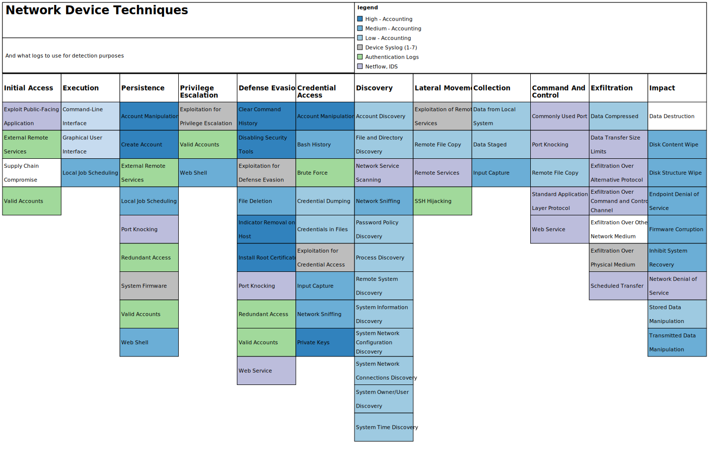

| Label | Tactic                                                             | Technique                                       | Data Sources                                                | Example Commands                                               | Comments                                                                                                                                                                                                                                                                                                                                                                                                                                                                                                 |
|-------|--------------------------------------------------------------------|-------------------------------------------------|-------------------------------------------------------------|----------------------------------------------------------------|----------------------------------------------------------------------------------------------------------------------------------------------------------------------------------------------------------------------------------------------------------------------------------------------------------------------------------------------------------------------------------------------------------------------------------------------------------------------------------------------------------|
| T1005 | Collection                                                         | Data from Local System                          | Accounting                                                  | `more *` `show *`                                           | This is not exfiltration of files, but reading them locally for information or copying.                                                                                                                                                                                                                                                                                                                                                                                                                  |
| T1074 | Collection                                                         | Data Staged                                     | Accounting                                                  | `tftp *` `rcp *` `puts [open * ]` `copy *`            | Files can be copied to the device or written on the device if it supports the "Tool Command Shell" (TCL).                                                                                                                                                                                                                                                                                                                                                                                                |
| T1056 | Collection                                                         | Input Capture                                   | Accounting                                                  | `show logging *` `show history *`                           | Adversaries can use logs to view what has recently been input by administrators to collect data.                                                                                                                                                                                                                                                                                                                                                                                                         |
| T1043 | Command and Control                                                | Commonly Used Port                              | NetFlow, IDS                                                | N/A                                                            | Use network traffic to see how, when and by whom the common ports are being accessed.                                                                                                                                                                                                                                                                                                                                                                                                                    |
| T1071 | Command and Control                                                | Standard Application Layer Protocol             | NetFlow, IDS                                                | N/A                                                            | Use network traffic to see how standard protocols are being used. Encryption of SSH and HTTPS will make this difficult, but tuple based meta-data can still show helpful information in determining legitimacy                                                                                                                                                                                                                                                                                           |
| T1139 | Credential Access                                                  | Bash History                                    | Accounting                                                  | `show history all`                                             | This Technique is only Linux currently, but the suggestion here is to expand it to include network devices. This command can very likely show credentials input from the command line, to include passwords, as well as keys for varying network tunnel configurations, SNMP community strings, and other valuable information to an adversary.                                                                                                                                                          |
| T1110 | Credential Access                                                  | Brute Force                                     | Authentication                                              | N/A                                                            | Similar to regular hosts, check for repeated authentication attempts in a small time frame against the varying authentication services: SSH, Telnet, Web login.                                                                                                                                                                                                                                                                                                                                          |
| T1003 | Credential Access                                                  | Credential Dumping                              | Accounting                                                  | `show running-config` `show startup-config`                 | This would allow the adversary to see what local users are configured on the system                                                                                                                                                                                                                                                                                                                                                                                                                      |
| T1081 | Credential Access                                                  | Credentials in Files                            | Accounting                                                  | `show archive config *` `show startup-config`               | An adversary could look at the current saved configuration or the archive configurations to find old credentials that may be useful later.                                                                                                                                                                                                                                                                                                                                                               |
| T1212 | Credential Access                                                  | Exploitation for Credential Access              | Syslog Error/Debug Level                                    | N/A                                                            | If specific known or zero-day vulnerabilities are not patched and get exploited, they generally create errors as the system isn't designed to work that way. These errors can be monitored for abnormalities to find exploit attempts.                                                                                                                                                                                                                                                                   |
| T1145 | Credential Access                                                  | Private Keys                                    | Accounting                                                  | `crypto pki export *`                                          | If, when a private key is made, and is set as exportable - then you can print out the private key portion. This should be closely monitored. Cisco also stores all private key in an unreadable file on flash called "private-config". If its exfiltrated, private key can be pulled from it.                                                                                                                                                                                                            |
| T1040 | Credential Access  Discovery                                       | Network Sniffing                                | Accounting                                                  | `monitor capture point *` `set span *` `set rspan`       | In order to find credentials or discover devices and services passively and adversary may set or modify a monitor session on the network device. They might also configure a SPAN or RSPAN to another system they own in the network for analysis.                                                                                                                                                                                                                                                       |
| T1146 | Defense Evasion                                                    | Clear Command History                           | Accounting                                                  | `clear logging *` `clear archive *`                         | A definite evasion technique, clearing the log is not often done by regular administrators and would be a good indicator of someone trying to hide.                                                                                                                                                                                                                                                                                                                                                      |
| T1089 | Defense Evasion                                                    | Disabling Security Tools                        | Accounting                                                  | `no aaa new-model` `no logging *`                           | Disabling of AAA or of the logging settings are indicators of disabling security tools.                                                                                                                                                                                                                                                                                                                                                                                                                  |
| T1211 | Defense Evasion                                                    | Exploitation for Defense Evasion                | Syslog Error/Debug Level                                    | N/A                                                            | If specific known or zero-day vulnerabilities are not patched and get exploited, they generally create errors as the system isn't designed to work that way. These errors can be monitored for abnormalities to find exploit attempts.                                                                                                                                                                                                                                                                   |
| T1107 | Defense Evasion                                                    | File Deletion                                   | Accounting                                                  | `erase *` `delete *`                                        | Similar to Disk Content Wipe, but with a different goal in mind. Instead of trying to delete the whole disk for Impact - a network device could be used as a file staging point for malware or data exfiltration. This would detect the deletion of those files.                                                                                                                                                                                                                                         |
| T1070 | Defense Evasion                                                    | Indicator Removal on Host                       | Accounting                                                  | `clear logging *` `clear archive *`                         | Adversaries may clear or alert the event logs to remove data indicating their presence on the system                                                                                                                                                                                                                                                                                                                                                                                                     |
| T1130 | Defense Evasion                                                    | Install Root Certificate                        | Accounting                                                  | `crypto pki import *` `crypto pki trustpoint *`             | An adversary could add additional certificates to your device. These should not be changed often, and you can easily whitelist your known good certificates in your analytic.                                                                                                                                                                                                                                                                                                                            |
| T1205 | Defense Evasion  Command and Control                               | Port Knocking                                   | NetFlow, IDS                                                | N/A                                                            | Use network traffic to detect port knocking, not supported by network devices by default, they could be running a malicious network operating system that does.                                                                                                                                                                                                                                                                                                                                          |
| T1102 | Defense Evasion  Command and Control                               | Web Service                                     | NetFlow, IDS                                                | N/A                                                            | Your network devices should not be talking to the internet, so this should be an easy analytic paired with a firewall block, not allowing the network device subnet to communicate through the perimeter.                                                                                                                                                                                                                                                                                                |
| T1087 | Discovery                                                          | Account Discovery                               | Accounting                                                  | `show running-config` `show startup-config`                 | Common show commands, validate it was your administrators performing the function.                                                                                                                                                                                                                                                                                                                                                                                                                       |
| T1083 | Discovery                                                          | File and Directory Discovery                    | Accounting                                                  | `dir *`                                                        | Common show commands, validate it was your administrators performing the function.                                                                                                                                                                                                                                                                                                                                                                                                                       |
| T1046 | Discovery                                                          | Network Service Scanning                        | NetFlow, IDS                                                | N/A                                                            | Similar to any port scan against regular hosts. Detect with IDS and network traffic.                                                                                                                                                                                                                                                                                                                                                                                                                     |
| T1201 | Discovery                                                          | Password Policy Discovery                       | Accounting                                                  | `aaa common-criteria policy`                                   | This is probably not set on your network devices, as its quite rare and not supported by a lot of them. But good to see if someone tries to enumerate it.                                                                                                                                                                                                                                                                                                                                                |
| T1057 | Discovery                                                          | Process Discovery                               | Accounting                                                  | `show processes *`                                             | Common show commands, validate it was your administrators performing the function.                                                                                                                                                                                                                                                                                                                                                                                                                       |
| T1018 | Discovery                                                          | Remote System Discovery                         | Accounting                                                  | `show arp` `show cdp *`                                     | Common show commands, validate it was your administrators performing the function.                                                                                                                                                                                                                                                                                                                                                                                                                       |
| T1082 | Discovery                                                          | System Information Discovery                    | Accounting                                                  | `show version`                                                 | Common show commands, validate it was your administrators performing the function.                                                                                                                                                                                                                                                                                                                                                                                                                       |
| T1016 | Discovery                                                          | System Network Configuration Discovery          | Accounting                                                  | `show run` `show ip route` `show ip interface`           | Common show commands, validate it was your administrators performing the function.                                                                                                                                                                                                                                                                                                                                                                                                                       |
| T1049 | Discovery                                                          | System Network Connections Discovery            | Accounting                                                  | `show ip sockets`                                              | Common show commands, validate it was your administrators performing the function.                                                                                                                                                                                                                                                                                                                                                                                                                       |
| T1033 | Discovery                                                          | System Owner/User Discovery                     | Accounting                                                  | `show users` `show ssh`                                     | Common show commands, validate it was your administrators performing the function.                                                                                                                                                                                                                                                                                                                                                                                                                       |
| T1124 | Discovery                                                          | System Time Discovery                           | Accounting                                                  | `show clock` `show clock detail`                            | Common show commands, validate it was your administrators performing the function.                                                                                                                                                                                                                                                                                                                                                                                                                       |
| T1059 | Execution                                                          | Command-Line Interface                          | Accounting                                                  | N/A                                                            | Collecting all of the AAA logs from all of your networking devices will allow you to perform auditing against the accounting logs and see what's being input via the command line.                                                                                                                                                                                                                                                                                                                       |
| T1061 | Execution                                                          | Graphical User Interface                        | Accounting                                                  | N/A                                                            | Adversaries that access a network device and attempt to configured it via the GUI can still be logged using AAA, as the equivalent command is still logged the same as if it was input on the CLI.                                                                                                                                                                                                                                                                                                       |
| T1002 | Exfiltration                                                       | Data Compressed                                 | Accounting                                                  | `archive tar *`                                                | Network devices support compressing and decompressing files to the file system.                                                                                                                                                                                                                                                                                                                                                                                                                          |
| T1030 | Exfiltration                                                       | Data Transfer Size Limits                       | NetFlow, IDS                                                | N/A                                                            | Data may be exfiltrated in small chunks to avoid detection, using network traffic look for small amounts of data leaving the network or going to a subnet that should not be communicating to a network device.                                                                                                                                                                                                                                                                                          |
| T1048 | Exfiltration                                                       | Exfiltration Over Alternative Protocol          | NetFlow, IDS                                                | N/A                                                            | Use network traffic to determine if exfiltration is occurring from the network devices. In general those devices shouldn't be talking to the internet, and can be blocked at the perimeter firewall.                                                                                                                                                                                                                                                                                                     |
| T1041 | Exfiltration                                                       | Exfiltration Over Command and Control Channel   | NetFlow, IDS                                                | N/A                                                            | Use network traffic to determine if exfiltration is occurring from the network devices. In general those devices shouldn't be talking to the internet, and can be blocked at the perimeter firewall.                                                                                                                                                                                                                                                                                                     |
| T1011 | Exfiltration                                                       | Exfiltration Over Other Network Medium          | N/A                                                         | N/A                                                            | This is a direct attempt to circumnavigate your logging and detection. Adversaries may plugin other hardware to your devices and exfiltrate data over other mediums.Secure physical access to your devices as much as possible.                                                                                                                                                                                                                                                                          |
| T1052 | Exfiltration                                                       | Exfiltration Over Physical Medium               | Syslog  Accounting                                          | `dir usbflash0:`                                               | Some network devices support USB's. Look for the USB plugin line from Syslog, and the directory change to USB flash from the accounting line.                                                                                                                                                                                                                                                                                                                                                            |
| T1029 | Exfiltration                                                       | Scheduled Transfer                              | NetFlow, IDS                                                | N/A                                                            | Data may be exfiltrated during certain times to avoid detection, using network traffic look for exfiltration of data at similar times on a repeatable basis.                                                                                                                                                                                                                                                                                                                                             |
| T1485 | Impact                                                             | Data Destruction                                | Accounting                                                  | N/A                                                            | Maybe difficult to detect, but because routers and switches have small amounts of memory, after a file is deleted, writing generic files to the disk and deleting them multiple times may make the original "target" file unrecoverable by forensic tools.                                                                                                                                                                                                                                               |
| T1488 | Impact                                                             | Disk Content Wipe                               | Accounting                                                  | `delete *` erase *`                                         | An adversary might want to delete all of your network device configurations and local backup configurations                                                                                                                                                                                                                                                                                                                                                                                              |
| T1487 | Impact                                                             | Disk Structure Wipe                             | Accounting                                                  | `format *`                                                     | An adversary, with appropriate privileges could run the format command to erase a flash disk and change its partition type. Cisco has Class A, B, and C types.                                                                                                                                                                                                                                                                                                                                           |
| T1499 | Impact                                                             | Endpoint Denial of Service                      | Accounting                                                  | `shutdown *`                                                   | An adversary could shutdown an interface on a Firewall or Router cause not only that end point to have a denial of service but also all the devices using its service.                                                                                                                                                                                                                                                                                                                                   |
| T1495 | Impact                                                             | Firmware Corruption                             | Accounting                                                  | `config-register 0x2100` `config-register 0x2142`           | An adversary could do damage to the ROMmon/NetBoot firmware of a cisco device if it was booted into that mode. Therefore changing the config-register of the device should be tracked as that will be the alert that the system is being changed to boot to firmware image.                                                                                                                                                                                                                              |
| T1490 | Impact                                                             | Inhibit System Recovery                         | Accounting                                                  | `archive maximum 1`                                            | As T1488 already covers deleting files off the filesystem, I take this technique as referring to deleting backup configurations. If the administrators are archiving locally and the adversary doesn't want to directly delete the files, they could change the maximum number of archive configurations that are kept. (A logic bomb could be done here).                                                                                                                                               |
| T1498 | Impact                                                             | Network Denial of Service                       | NetFlow, IDS                                                | N/A                                                            | Similar to any network flood against an open port to overwhelm resources. Detect with IDS and network traffic.                                                                                                                                                                                                                                                                                                                                                                                           |
| T1492 | Impact                                                             | Stored Data Manipulation                        | Accounting                                                  | `copy *` `configure replace`                                | Because deleting files is covered by two other Impact Techniques, I take this technique to mean modifying the configuration of a stored config in a network device. So after modifying a configuration an adversary might archive it or copy it to the start up.                                                                                                                                                                                                                                         |
| T1493 | Impact                                                             | Transmitted Data Manipulation                   | Accounting                                                  | `access-list *` `ip access-group *`                         | An adversary might modify data in transit from other hosts, by modifying the configuration on a network device. They might change an ACL so the data doesn't get to it's intended destination, or change the QOS so the service delivery isn't what was originally intended. You'll want to whitelist the known authorized access list's in your baseline config.                                                                                                                                        |
| T1190 | Initial Access                                                     | Exploit Public-Facing Application               | NetFlow, IDS                                                | N/A                                                            | Can have built-in web applications for configuration purposes. These web applications could be vulnerable to exploitation if they are not kept up-to-date with patching, or logged into with default or known credentials. Typically Firewalls or VPN devices are left as internet facing and would be most likely vulnerable to this technique, but switches and routers have also been left internet facing unintentionally as well. The Web application logs are not readily available for analysis.  |
| T1195 | Initial Access                                                     | Supply Chain Compromise                         | Image Hash Validation                                       | N/A                                                            | Very difficult to detect, would suggest copying off the OS for hashing by a third party tool to validate it against the vendor's known good image hash list.                                                                                                                                                                                                                                                                                                                                             |
| T1133 | Initial Access  Persistence                                        | External Remote Services                        | Authentication                                              | N/A                                                            | Internet Facing remote services should be minimized to the greatest extent, and authentication to network devices should only be authorized from specific internal subnets                                                                                                                                                                                                                                                                                                                               |
| T1078 | Initial Access  Persistence  Privilege Escalation  Defense Evasion | Valid Accounts                                  | Authentication                                              | N/A                                                            | Known credentials is a very likely way that a threat actor will compromise your systems. Its good to have a baseline of which admins login, to what devices, and a what times. Then custom detections can be made tailored to your environment on what falls outside of the norm.                                                                                                                                                                                                                        |
| T1210 | Lateral Movement                                                   | Exploitation of Remote Services                 | Syslog Error/Debug Level                                    | N/A                                                            | If specific known or zero-day vulnerabilities are not patched and get exploited, they generally create errors as the system isn't designed to work that way.These errors can be monitored for abnormalities to find exploit attempts.                                                                                                                                                                                                                                                                    |
| T1021 | Lateral Movement                                                   | Remote Services                                 | NetFlow, IDS  Authentication                                | N/A                                                            | Adversaries may use remotely available services hosted by the network devices like: SSH, Telnet, Web Application. Use network traffic to ensure this is only occurring from authorized subnets.                                                                                                                                                                                                                                                                                                          |
| T1184 | Lateral Movement                                                   | SSH Hijacking                                   | Authentication                                              | N/A                                                            | Adversaries can use SSH keys collected from elsewhere on the network and use those to login to network devices. Monitor authentication logs to ensure they stay consistent with the baseline.                                                                                                                                                                                                                                                                                                            |
| T1105 | Lateral Movement  Command and Control                              | Remote File Copy                                | Accounting                                                  | `tftp *` `rcp *` `copy *`                                | Similar to data staged, look for files copied to or from the device.                                                                                                                                                                                                                                                                                                                                                                                                                                     |
| T1136 | Persistence                                                        | Create Account                                  | Accounting                                                  | `username *`                                                   | Creating new local accounts can be monitored from the accounting logs. A new accounts might be created, used, and deleted in an attempt to hide. Or a new account created for persistence or fall back access.                                                                                                                                                                                                                                                                                           |
| T1168 | Persistence                                                        | Local Job Scheduling                            | Accounting                                                  | `kron policy-list *` `kron occurrence *` `policy-list *` | A newer feature to cisco IOS is kron and can minimally be used to created a scheduled job. New jobs should be monitored.                                                                                                                                                                                                                                                                                                                                                                                 |
| T1019 | Persistence                                                        | System Firmware                                 | Device Syslog                                               | N/A                                                            | An adversary could completely replace the IOS that the firmware boots, with a malicious version. There is a known version of this malware called SYNfulKnock.                                                                                                                                                                                                                                                                                                                                            |
| T1098 | Persistence  Credential Access                                     | Account Manipulation                            | Accounting                                                  | `username *` `aaa *`                                        | Modifying accounts and permissions is auditable via the accounting log. Monitor not only local account modification, but also remote authentication configurations.                                                                                                                                                                                                                                                                                                                                      |
| T1108 | Persistence  Defense Evasion                                       | Redundant Access                                | Accounting  Authentication  NetFlow, IDS  Web Logs          | N/A                                                            | Adversaries can have more than one way into the network, so monitoring the other Persistence and access techniques should allow you to see who is accessing the devices, from where. Check Authentication logs, new user accounts, SSH, and web accesses.                                                                                                                                                                                                                                                |
| T1100 | Persistence  Privilege Escalation                                  | Web Shell                                       | NetFlow, IDS  Authentication  Accounting                    | `ip http server` `ip https server`                          | If the network admins have the GUI interface turned on, an adversary could use it - detect with NetFlow. Or an adversary could turn it on with the right credentials - detect with accounting logs.                                                                                                                                                                                                                                                                                                      |
| T1068 | Privilege Escalation                                               | Exploitation for Privilege Escalation           | Syslog Error/Debug Level                                    | N/A                                                            | If specific known or zero-day vulnerabilities are not patched and get exploited, they generally create errors as the system isn't designed to work that way. These errors can be monitored for abnormalities to find exploit attempts.                                                                                                                                                                                                                                                                   |