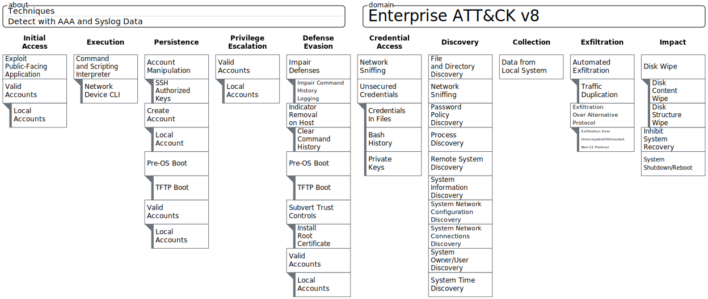

#Network Device Techniques by Data Source, now with Sub-Tecniques!

For Beta ATT&CK with Sub-Techniques use this [JSON](Network_Device_Sub-Techniques.json) file to this [ATT&CK Navigator](https://mitre-attack.github.io/attack-navigator/beta/enterprise/) instance to replicate the above image.

For legacy ATT&CK upload this [JSON](Network_Device_Techniques.json) file to an [ATT&CK Navigator](https://mitre-attack.github.io/attack-navigator/enterprise/) instance to replicate the legacy image.

|Label    |Tactic                                                                  |Technique                             |Sub-Technique                                         |Data Sources                                |Example Commands                                                        |Comments                                                                                                                                                                                                                                                                                                                                                                          |
|---------|------------------------------------------------------------------------|--------------------------------------|------------------------------------------------------|--------------------------------------------|------------------------------------------------------------------------|----------------------------------------------------------------------------------------------------------------------------------------------------------------------------------------------------------------------------------------------------------------------------------------------------------------------------------------------------------------------------------|
|T1190    |Initial Access                                                          |Exploit Public-Facing Application     |                                                      |NetFlow, IDS                                |N/A                                                                     |Network Devices can have built-in web applications for configuration purposes.  These web applications could be vulnerable to exploitation if they are not kept up-to-date with patching, or logged into with default or known credentials. The Web application logs are not readily available for analysis.                                                                      |
|T1133    |Initial Access Persistence                                           |External Remote Services              |                                                      |Authentication                              |N/A                                                                     |Firewalls, VPNs and Wireless Access Points are common remote services that can be misconfigured.  Internet Facing remote services should be minimized to the greatest extent and authentication to network devices should only be authorized from specific internal subnets.                                                                                                      |
|T1091    |Initial Access Lateral Movement                                      |Replication Through Removable Media   |                                                      |Syslog                                      |N/A                                                                     |Custom firmware can be copied from a USB drive to a network device, and a custom ROM MON can be loaded that modifies how the device functions.                                                                                                                                                                                                                                    |
|T1195.001|Initial Access                                                          |Supply Chain Compromise               |Compromise Software Dependencies and Development Tools|N/A                                         |N/A                                                                     |Supply chain compromises can affect network infrastructure devices too, though they would be difficult to detect.  Network devices have external management software that could be used to compromise the devices                                                                                                                                                                 |
|T1195.002|Initial Access                                                          |Supply Chain Compromise               |Compromise Software Supply Chain                      |N/A                                         |N/A                                                                     |Supply chain compromises can affect network infrastructure devices too, though they would be difficult to detect.  For IOS validation copy the image from the device and use an externally hashing tool to compare to the official known good hash                                                                                                                                |
|T1195.003|Initial Access                                                          |Supply Chain Compromise               |Compromise Hardware Supply Chain                      |N/A                                         |N/A                                                                     |Supply chain compromises can affect network infrastructure devices too, though they would be difficult to detect.  Use network traffic to see if a backdoor is being accessed.                                                                                                                                                                                                    |
|T1078.001|Initial Access Persistence Privilege Escalation Defense Evasion|Valid Accounts                        |Default Account                                       |Syslog                                      |N/A                                                                     |Known credentials is a very likely way that a threat actor will compromise your systems.  Network Devices are commonly known for their default credentials.  These logins can be seen in Syslog messages, please change the username and passwords.                                                                                                                               |
|T1078.003|Initial Access Persistence Privilege Escalation Defense Evasion|Valid Accounts                        |Local Account                                         |Syslog                                      |N/A                                                                     |Stolen credentials is a very likely way that a threat actor will compromise your systems.  It's good to have a baseline of which admins login, to what devices, and a what times. These logins can b seen in Syslog messages.  Use centralized Authentication with RADIUS or TACACS+ for better protection.                                                                       |
|T1078.005|Initial Access Persistence Privilege Escalation Defense Evasion|Valid Accounts                        |AAA Account                                           |Authentication                              |N/A                                                                     |Stolen credentials are a very likely way that a threat actor will compromise your systems.  It's good to have a baseline of which admins login, to what devices, and a what times. Authentication logs in AAA can be used to audit login activity.                                                                                                                                |
|T1059.006|Execution                                                               |Command and Scripting Interpreter     |Python                                                |Accounting                                  |N/A                                                                     |Collecting all of the AAA logs from all of your networking devices will allow you to perform auditing against the accounting logs and see what's being input via the command line.                                                                                                                                                                                                |
|T1059.007|Execution                                                               |Command and Scripting Interpreter     |IOS Shell                                             |Accounting                                  |N/A                                                                     |Collecting all of the AAA logs from all of your networking devices will allow you to perform auditing against the accounting logs and see what's being input via the command line or use to Tool Command Language (TCL) shell.                                                                                                                                                    |
|T1106    |Execution                                                               |Native API                            |                                                      |Accounting                                  |N/A                                                                     |Newer network devices provide API access to execute configuration commands on devices, with tools like Python                                                                                                                                                                                                                                                                     |
|T1053.006|Execution Persistence Privilege Escalation                        |Scheduled Task/Job                    |Kron                                                  |Accounting                                  |`kron policy-list` `kron occurrence` `policy-list`                |A newer feature to Cisco IOS is kron and can minimally be used to create a scheduled job.  New jobs should be monitored.                                                                                                                                                                                                                                                          |
|T1136.001|Persistence                                                             |Create Account                        |Local Account                                         |Accounting                                  |`username` `aaa`                                                     |Creating new local accounts can be monitored from the accounting logs.  New accounts might be created, used, and deleted in an attempt to hide.  Or a new account created for persistence or fall back access. Modifying accounts and permissions is auditable via the accounting log.  Monitor not only local account modification but also remote authentication configurations.|
|T1546.016|Persistence Privilege Escalation                                     |Event Triggered Execution             |Embedded Event Manager                                |Accounting                                  |N/A                                                                     |Cisco embedded event manager allows policies to be written into the configuration to execute based on events occurring on the system.  For example, if a mac-address is added to the cache, send a Syslog message.                                                                                                                                                                |
|T1542.001|Persistence Defense Evasion                                          |Pre-OS Boot                           |System Firmware                                       |Device Syslog                               |N/A                                                                     |An adversary could completely replace the IOS that the firmware boots, with a malicious version.  There is a known version of this malware called SYNful Knock.                                                                                                                                                                                                                   |
|T1505.003|Persistence Privilege Escalation                                     |Server Software Component             |Web Shell                                             |NetFlow, IDS Authentication Accounting|`ip http server` `ip https server`                                   |If the network admins have the GUI interface turned on, an adversary could use it - detect with NetFlow.  Or an adversary could turn it on with the right credentials - detect with accounting logs.                                                                                                                                                                              |
|T1068    |Privilege Escalation                                                    |Exploitation for Privilege Escalation |                                                      |Syslog Error/Debug Level                    |N/A                                                                     |This is the most common way that network devices have privilege escalation attacks leveraged against them.  Vulnerabilities, typically in the Web GUI application of the device.                                                                                                                                                                                                  |
|T1211    |Defense Evasion                                                         |Exploitation for Defense Evasion      |                                                      |Syslog Error/Debug Level                    |N/A                                                                     |If specific known or zero-day vulnerabilities are not patched and get exploited, they generally create errors as the system isn't designed to work that way.  These errors can be monitored for abnormalities to find exploit attempts.                                                                                                                                           |
|T1562.007|Defense Evasion                                                         |Impair Defenses                       |Disable Command Logging                               |Accounting                                  |`no aaa new-model` `no logging` `no archive`                      |Disabling of AAA or the logging, settings are indicators of disabling security tools.                                                                                                                                                                                                                                                                                             |
|T1551.002|Defense Evasion                                                         |Indicator Removal on Host             |Clear Linux or Mac System Logs                        |Accounting                                  |`clear logging`                                                         |Adversaries may clear or alert the event logs to remove data indicating their presence on the system                                                                                                                                                                                                                                                                              |
|T1551.003|Defense Evasion                                                         |Indicator Removal on Host             |Clear Command History                                 |Accounting                                  |`clear cli history` `clear archive`                                  |A definite evasion technique, clearing the log is not often done by regular administrators and would be a good indicator of someone trying to hide.                                                                                                                                                                                                                               |
|T1551.004|Defense Evasion                                                         |Indicator Removal on Host             |File Deletion                                         |Accounting                                  |`erase` `delete`                                                     |Similar to Disk Content Wipe, but with a different goal in mind.  Instead of trying to delete the whole disk for Impact - a network device could be used as a file staging point for malware or data exfiltration. This would detect the deletion of those files.                                                                                                                 |
|T1553.004|Defense Evasion                                                         |Subvert Trust Controls                |Install Root Certificate                              |Accounting                                  |`crypto pki import` `crypto pki trustpoint`                          |An adversary could add additional certificates to your device.  These should not be changed often, and you can easily whitelist your known good certificates in your analytic.                                                                                                                                                                                                    |
|T1545.001|Defense Evasion Command and Control                                  |Traffic Signaling                     |Port Knocking                                         |NetFlow, IDS                                |N/A                                                                     |Use network traffic to detect port knocking, not supported by network devices by default, they could be running a malicious network operating system that does.                                                                                                                                                                                                                   |
|T1110.001|Credential Access                                                       |Brute Force                           |Password Guessing                                     |Authentication                              |N/A                                                                     |Check for repeated authentication attempts in a small time frame against the varying authentication services: SSH, Telnet, Web login.                                                                                                                                                                                                                                             |
|T1110.002|Credential Access                                                       |Brute Force                           |Password Cracking                                     |Authentication                              |N/A                                                                     |After obtaining hashes from a config file, IOS hashes can be easily cracked offline                                                                                                                                                                                                                                                                                               |
|T1110.003|Credential Access                                                       |Brute Force                           |Password Spraying                                     |Authentication                              |N/A                                                                     |Check for repeated authentication attempts in a small time frame against the varying authentication services: SSH, Telnet, Web login.                                                                                                                                                                                                                                             |
|T1110.004|Credential Access                                                       |Brute Force                           |Credential Stuffing                                   |Authentication                              |N/A                                                                     |Audit the authentication logs of the varying authentication services: SSH, Telnet, Web login.                                                                                                                                                                                                                                                                                     |
|T1212    |Credential Access                                                       |Exploitation for Credential Access    |                                                      |Syslog Error/Debug Level                    |N/A                                                                     |If specific known or zero-day vulnerabilities are not patched and get exploited, they generally create errors as the system isn't designed to work that way.  These errors can be monitored for abnormalities to find exploit attempts.                                                                                                                                           |
|T1040    |Credential Access Discovery                                          |Network Sniffing                      |                                                      |Accounting                                  |`monitor capture point` `set span` `set rspan`                    |To find credentials or discover devices and services passively and adversaries may set or modify a monitor session on the network device.  They might also configure a SPAN or RSPAN to another system they own in the network for analysis.                                                                                                                                      |
|T1552.001|Credential Access                                                       |Unsecured Credentials                 |Credentials in Files                                  |Accounting                                  |`show running-config` `show startup-config` `show archive config` |This would allow the adversary to see what local users are configured on the system                                                                                                                                                                                                                                                                                               |
|T1552.003|Credential Access                                                       |Unsecured Credentials                 |Bash History                                          |Accounting                                  |`show logging` `show history`                                        |This Technique is only Linux currently, but the suggestion here is to expand it to include network devices.  This command can very likely show credentials input from the command line, to include passwords, as well as keys for varying network tunnel configurations, SNMP community strings, and other valuable information to an adversary.                                  |
|T1552.004|Credential Access                                                       |Unsecured Credentials                 |Private Keys                                          |Accounting                                  |`crypto pki export`                                                     |If, when a private key is made, and is set as exportable - then you can print out the private key portion.  This should be closely monitored.  Cisco also stores all private key in an unreadable file on flash called "private-config".  If its exfiltrated, the private key can be pulled from it.                                                                              |
|T1087.001|Discovery                                                               |Account Discovery                     |Local Account                                         |Accounting                                  |`show running-config` `show startup-config`                          |Common show commands, validate it was your administrators performing the function.                                                                                                                                                                                                                                                                                                |
|T1083    |Discovery                                                               |File and Directory Discovery          |                                                      |Accounting                                  |`dir`                                                                   |Common show commands, validate it was your administrators performing the function.                                                                                                                                                                                                                                                                                                |
|T1046    |Discovery                                                               |Network Service Scanning              |                                                      |NetFlow, IDS                                |N/A                                                                     |Similar to any port scan against regular hosts.  Detect with IDS and network traffic.                                                                                                                                                                                                                                                                                             |
|T1201    |Discovery                                                               |Password Policy Discovery             |                                                      |Accounting                                  |`aaa common-criteria policy`                                            |This is probably not set on your network devices, as its quite rare and not supported by a lot of them.  But good to see if someone tries to enumerate it.                                                                                                                                                                                                                        |
|T1057    |Discovery                                                               |Process Discovery                     |                                                      |Accounting                                  |`show processes`                                                        |Common show commands, validate it was your administrators performing the function.                                                                                                                                                                                                                                                                                                |
|T1018    |Discovery                                                               |Remote System Discovery               |                                                      |Accounting                                  |`show arp` `show cdp`                                                |Common show commands, validate it was your administrators performing the function.                                                                                                                                                                                                                                                                                                |
|T1082    |Discovery                                                               |System Information Discovery          |                                                      |Accounting                                  |`show version`                                                          |Common show commands, validate it was your administrators performing the function.                                                                                                                                                                                                                                                                                                |
|T1016    |Discovery                                                               |System Network Configuration Discovery|                                                      |Accounting                                  |`show run` `show ip route` `show ip interface`                    |Common show commands, validate it was your administrators performing the function.                                                                                                                                                                                                                                                                                                |
|T1049    |Discovery                                                               |System Network Connections Discovery  |                                                      |Accounting                                  |`show ip sockets`                                                       |Common show commands, validate it was your administrators performing the function.                                                                                                                                                                                                                                                                                                |
|T1033    |Discovery                                                               |System Owner/User Discovery           |                                                      |Accounting                                  |`show users` `show ssh`                                              |Common show commands, validate it was your administrators performing the function.                                                                                                                                                                                                                                                                                                |
|T1124    |Discovery                                                               |System Time Discovery                 |                                                      |Accounting                                  |`show clock` `show clock detail`                                     |Common show commands, validate it was your administrators performing the function.                                                                                                                                                                                                                                                                                                |
|T1210    |Lateral Movement                                                        |Exploitation of Remote Services       |                                                      |Syslog Error/Debug Level                    |N/A                                                                     |If specific known or zero-day vulnerabilities are not patched and get exploited, they generally create errors as the system isn't designed to work that way.  These errors can be monitored for abnormalities to find exploit attempts.                                                                                                                                           |
|T1570    |Lateral Movement                                                        |Lateral Tool Transfer                 |                                                      |Accounting                                  |`tftp` `rcp` `copy`                                               |Similar to data staged, look for files copied to or from the device.                                                                                                                                                                                                                                                                                                              |
|T1563.001|Lateral Movement                                                        |Remote Service Session Hijacking      |SSH Hijacking                                         |Authentication                              |N/A                                                                     |Adversaries can use SSH keys collected from elsewhere on the network and use those to log in to network devices.  Monitor authentication logs to ensure they stay consistent with the baseline.                                                                                                                                                                                   |
|T1021.004|Lateral Movement                                                        |Remote Services                       |SSH                                                   |NetFlow, IDS Authentication              |N/A                                                                     |Adversaries may use remotely available services with Valid Accounts like SSH or Telnet. Use network traffic to ensure this is only occurring from authorized subnets. Use AAA to audit Authentication logs.                                                                                                                                                                       |
|T1560.001|Collection                                                              |Archive Collected Data                |Archive via Utility                                   |Accounting                                  |`archive tar /create`                                                   |Network devices support compressing and decompressing files to the file system.                                                                                                                                                                                                                                                                                                   |
|T1119    |Collection                                                              |Automated Collection                  |                                                      |Accounting                                  |`scripting tcl` `tclsh`                                              |Tool Command Language is a scripting utility for Cisco IOS                                                                                                                                                                                                                                                                                                                        |
|T1005    |Collection                                                              |Data from Local System                |                                                      |Accounting                                  |`more` `show` `dir`                                               |This is not exfiltration of files, but reading them locally for information or copying.                                                                                                                                                                                                                                                                                           |
|T1005    |Collection                                                              |Data from Removable Media             |                                                      |Accounting                                  |`dir usbflash0:`                                                        |Searching attached USB File systems                                                                                                                                                                                                                                                                                                                                               |
|T1074.001|Collection                                                              |Data Staged                           |Local Data Staging                                    |Accounting                                  |`append` `mkdir`                                                     |Create or edit a file or directory locally                                                                                                                                                                                                                                                                                                                                        |
|T1074.002|Collection                                                              |Data Staged                           |Remote Data Staging                                   |Accounting                                  |`tftp` `rcp` `copy \{ftp: | rcp: | tftp:\}`                       |Files can be copied to the device or written on the device.                                                                                                                                                                                                                                                                                                                       |
|T1071.001|Command and Control                                                     |Application Layer Protocol            |Web Protocols                                         |NetFlow, IDS, Accounting                    |`ip sla`                                                                |Use network traffic to see how standard protocols are being used.  Encryption of SSH and HTTPS will make this difficult, but tuple based meta-data can still show helpful information in determining the legitimacy                                                                                                                                                               |
|T1071.002|Command and Control                                                     |Application Layer Protocol            |File Transfer Protocols                               |NetFlow, IDS                                |N/A                                                                     |Use network traffic to see how standard protocols are being used.  Encryption of SSH and HTTPS will make this difficult, but tuple based meta-data can still show helpful information in determining the legitimacy                                                                                                                                                               |
|T1102.001|Command and Control                                                     |Web Service                           |Dead Drop Resolver                                    |NetFlow, IDS                                |N/A                                                                     |Your network devices should not be talking to the internet, so this should be an easy analytic paired with a firewall block, not allowing the network device subnet to communicate through the perimeter.                                                                                                                                                                         |
|T1102.003|Command and Control                                                     |Web Service                           |One-Way Communication                                 |NetFlow, IDS                                |N/A                                                                     |Your network devices should not be talking to the internet, so this should be an easy analytic paired with a firewall block, not allowing the network device subnet to communicate through the perimeter.                                                                                                                                                                         |
|T1020    |Exfiltration                                                            |Automated Exfiltration                |                                                      |Accounting, NetFlow                         |`tclsh` `scripting tcl`                                              |Automated exfiltration using scripting                                                                                                                                                                                                                                                                                                                                            |
|T1030    |Exfiltration                                                            |Data Transfer Size Limits             |                                                      |NetFlow, IDS                                |N/A                                                                     |Data may be exfiltrated in small chunks to avoid detection, using network traffic look for small amounts of data leaving the network or going to a subnet that should not be communicating with a network device.                                                                                                                                                                 |
|T1041    |Exfiltration                                                            |Exfiltration Over C2 Channel          |                                                      |NetFlow, IDS                                |N/A                                                                     |Use network traffic to determine if exfiltration is occurring from the network devices.  In general those devices shouldn't be talking to the internet, and can be blocked at the perimeter firewall.                                                                                                                                                                             |
|T1052.001|Exfiltration                                                            |Exfiltration Over Physical Medium     |Exfiltration over USB                                 |Syslog Accounting                        |`dir usbflash0:`                                                        |Some network devices support USB's.  Look for the USB plugin line from Syslog, and the directory change to USB flash from the accounting line.                                                                                                                                                                                                                                    |
|T1029    |Exfiltration                                                            |Scheduled Transfer                    |                                                      |NetFlow, IDS, Accounting                    |`kron policy-list` `kron occurrence` `policy-list`                |Data may be exfiltrated during certain times to avoid detection, using network traffic look for exfil of data at similar times on a repeatable basis.                                                                                                                                                                                                                             |
|T1531    |Impact                                                                  |Account Access Removal                |                                                      |Accounting                                  |`no username` `no aaa new-model`                                     |Deleting legitimate users to prevent authorized access and administration                                                                                                                                                                                                                                                                                                         |
|T1485    |Impact                                                                  |Data Destruction                      |                                                      |Accounting                                  |N/A                                                                     |Maybe difficult to detect, but because routers and switches have small amounts of memory, after a file is deleted, writing generic files to the disk and deleting them multiple times may make the original "target" file unrecoverable by forensic tools.                                                                                                                        |
|T1565.001|Impact                                                                  |Data Manipulation                     |Stored Data Manipulation                              |Accounting                                  |`copy` `configure replace`                                           |Because deleting files is covered by two other Impact Techniques, I take this technique to mean modifying the configuration of a stored config in a network device.  So after modifying a configuration an adversary might archive it or copy it to the startup.                                                                                                                  |
|T1565.002|Impact                                                                  |Data Manipulation                     |Transmitted Data Manipulation                         |Accounting                                  |`access-list` `ip access-group`                                      |An adversary might modify data in transit from other hosts, by modifying the configuration on a network device.  They might change an ACL so the data doesn't get to it's intended destination, or change the QOS so the service delivery isn't what was originally intended. You'll want to whitelist the known authorized access lists in your baseline config.                 |
|T1561.001|Impact                                                                  |Disk Wipe                             |Disk Content Wipe                                     |Accounting                                  |`delete` `erase`                                                     |An adversary might want to delete all of your network device configurations and local backup configurations                                                                                                                                                                                                                                                                       |
|T1561.002|Impact                                                                  |Disk Wipe                             |Disk Structure Wipe                                   |Accounting                                  |`format`                                                                |An adversary, with appropriate privileges, could run the format command to erase a flash disk and change its partition type.  Cisco has Class A, B, and C types.                                                                                                                                                                                                                  |
|T1499.002|Impact                                                                  |Endpoint Denial of Service            |Service Exhaustion Flood                              |Accounting                                  |N/A                                                                     |A flood against the services the devices are providing                                                                                                                                                                                                                                                                                                                            |
|T1495    |Impact                                                                  |Firmware Corruption                   |                                                      |Accounting                                  |`config-register 0x2100` `config-register 0x2142`                    |An adversary could do damage to the ROMmon/NetBoot firmware of a cisco device if it was booted into that mode.  Therefore changing the config-register of the device should be tracked as that will be the alert that the system is being changed to boot to firmware image.                                                                                                      |
|T1490    |Impact                                                                  |Inhibit System Recovery               |                                                      |Accounting                                  |`archive`   `maximum 1`                                              |As T1488 already covers deleting files off the filesystem, I take this technique as referring to deleting backup configurations.  If the administrators are archiving locally and the adversary doesn't want to directly delete the files, they could change the maximum number of archive configurations that are kept.  (A logic bomb could be done here).                      |
|T1498.001|Impact                                                                  |Network Denial of Service             |Direct Network Flood                                  |NetFlow, IDS                                |N/A                                                                     |Similar to any network flood against an open port to overwhelm resources.  Detect with IDS and network traffic.                                                                                                                                                                                                                                                                   |
|T1529    |Impact                                                                  |System Shutdown/Reboot                |                                                      |Accounting                                  |`reload` `shutdown`                                                  |Reload the device or shutdown an interface                                                                                                                                                                                                                                                                                                                                        |